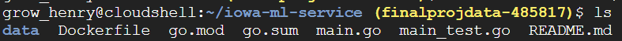
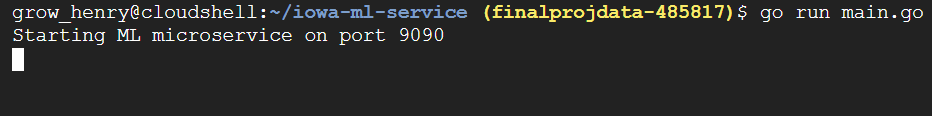

# Iowa Liquor Sales ML Service

A containerized Go microservice application that uses a machine learning library and is based on a small sample of my project data. Accepts JSON input and Returns JSON output. 

## JSON Training Data
### I ran the following Query based on Iowa Liquor Sales Biq Query Dataset to get bottles sold each month from 2015 to 2025  

SELECT
  EXTRACT(YEAR  FROM date) AS year,
  EXTRACT(MONTH FROM date) AS month,
  SUM(bottles_sold)        AS bottles_sold
FROM `bigquery-public-data.iowa_liquor_sales.sales`
WHERE date >= '2015-01-01'
  AND date <  '2025-01-01'
GROUP BY year, month
ORDER BY year, month;

## Features

- Loads training data from `data/training.json`
- Trains a regression model at startup
- Exposes REST endpoints:
  - `GET /health`
  - `GET /data`
  - `POST /predict`

## Run locally:

go run main.go

## Once running open new terminal and run: 

curl http://localhost:9090/health

curl -X POST http://localhost:9090/predict \
  -H "Content-Type: application/json" \
  -d '{"year":"2023","month":"6"}'

# Run with Docker

## Build 

docker build -t iowa-ml-service:latest .

## Run 

docker run --rm -p 9090:9090 iowa-ml-service:latest

### Example Request 

JSON 
{
  "year": 2023,
  "month": 6,
  "predicted_bottles_sold": 2621439.2621603045
}

### Example Output 

JSON 
{
  "year": 2023,
  "month": 6,
  "predicted_bottles_sold": 2621439.2621603045
}

# Make a Test 

nano main_test.go

Paste the following: 

package main

import "testing"

func TestTrainingDataFilePath(t *testing.T) {
	err := loadTrainingData("./data/training.json")
	if err != nil {
		t.Fatalf("expected training data to load, got error: %v", err)
	}
	if len(trainingData) == 0 {
		t.Fatal("expected training data to contain rows")
	}
}

### Screenshots Demonstrating Operation

